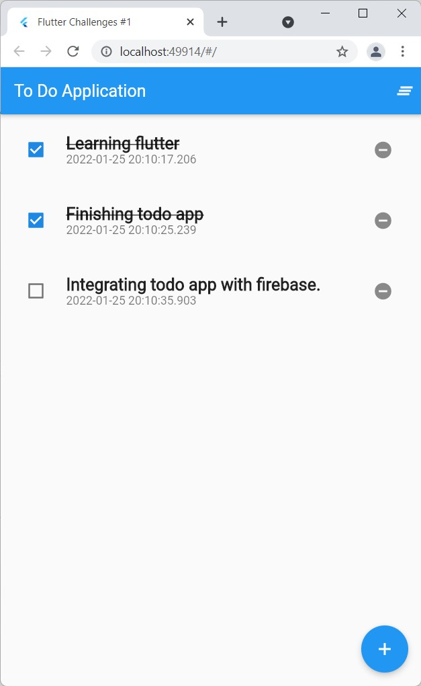

# Flutter Coding Challenges : CRUD Todo App

Flutter Coding Challenges Day 1 : CRUD Todo Application with Provider & Shared Preferences 

## Getting Started

After completing this project you'll learn,
- Creating distinct folder structure 
- Creating models , JSON encoding/decoding, operator overloading,copying objects
- Using ChangeNotifier to update application state
- Using shared preferences for persistant storage
- Using provider for state management
- Showing popup dialog
- Custom Type definitions
- Passing data between widgets/classes

### Things that could be improved
- Firebase integration
- Better design
- Code refactoring
- More functionalities

